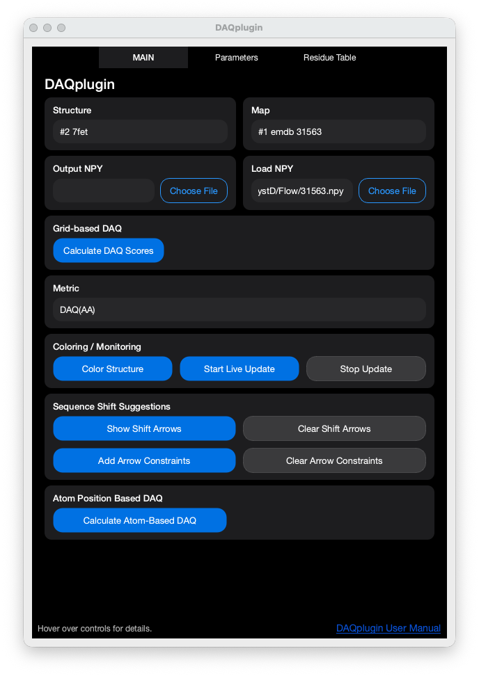
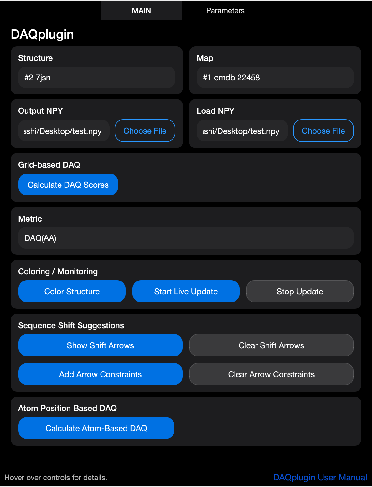

# DAQplugin

DAQplugin is a collection of tools for computing, visualizing, and exporting **DAQ scores** for protein atomic models in cryo-EM maps.

This repository provides:

- Google Colab ready Jupyter notebooks for DAQ score computation and NPY file generation ([DAQ_Score_Grid.ipynb](https://colab.research.google.com/github/gterashi/DAQplugin/blob/main/DAQ_Score_Grid.ipynb))
- A ChimeraX plugin (`daqcolor`) for interactive coloring and visualization
- Command-line utilities for processing and file export

DAQ is included as a Git submodule to ensure consistency with published methods.

If you use DAQplugin, please cite the following paper:

- Terashi, G., Wang, X., Maddhuri Venkata Subramaniya, S. R., Tesmer, J. J., & Kihara, D. (2022). Residue-wise local quality estimation for protein models from cryo-EM maps. Nature methods, 19(9), 1116-1125. ([Nature Methods article](https://www.nature.com/articles/s41592-022-01574-4))

---

## Table of Contents

- [Quick Start](#quick-start)
- [Installation](#installation-on-chimerax-toolshed)
- [Installation from Prebuilt Wheel](#installation-from-prebuilt-wheel)
- [1. DAQ Score Computation (Jupyter Notebooks)](#1-daq-score-and-npy-file-computation-jupyter-notebook-on-google-colab)
  - [Grid-based Notebook](#notebook)
  - [PDB-based Notebook](#daq-score-pdb-notebook)
- [2. ChimeraX Plugin: daqcolor](#2-chimerax-plugin-daqcolor)
  - [Installation](#installation-developer-mode)
  - [Commands](#commands)
    - [Apply DAQ coloring](#apply-daq-coloring-once)
    - [Live Monitoring](#live-monitoring)
    - [Visualize point clouds](#visualize-point-clouds)
  - [DAQ Score Computation](#daq-score-computation-chimerax)
    - [Grid-based computation](#compute-daq-scores-from-a-map-grid-based)
    - [PDB-based computation](#compute-daq-scores-from-a-map-pdb-based)
  - [Saving Colored Models](#saving-colored-models)
- [3. Command-Line Usage (CLI)](#3-command-line-usage-cli)
- [Notes](#notes)
- [License](#license)
- Appendix: [GPU Acceleration and Backends](#gpu-acceleration-and-backends), [Building the Wheel](#building-the-wheel)

---

## Quick Start


<details>
<summary><b>Repository Structure</b></summary>

```text
DAQplugin/
├── DAQ/                       # DAQ core (git submodule)
├── daqcolor/                  # ChimeraX plugin
│   ├── src/                   # plugin source (commands, compute, ONNX/MLX backends, GUI)
│   ├── pyproject.toml         # bundle metadata; backends gated by PEP 508 markers
│   ├── build_wheels.py        # builds the single py3-none-any wheel
│   ├── wheels/                # output of build_wheels.py (generated)
│   └── LICENSE
├── cli/                       # Command-line scripts
├── map_util/                  # Map preprocessing utilities
├── tools/                     # Conversion + parity-test utilities (MLX, profiling)
├── DAQ_Score.ipynb            # Original DAQ score calculation notebook
├── DAQ_Score_Grid.ipynb       # Grid / NPY generation notebook
├── DAQ_Score_Pdb.ipynb        # PDB coordinate based DAQ score calculation notebook
├── README.md
└── LICENSE
```

</details>

---

## Installation on ChimeraX Toolshed
- In the Menu bar: Tools > More Tools > DAQplugin page > Click [Download]
- A single cross-platform wheel is published; pip resolves the right backend stack (TensorRT/CUDA on Linux, DirectML on Windows, ORT-CPU + MLX on macOS) at install time using PEP 508 environment markers.

### Start GUI
- Tools > Validation > DAQplugin

---

## Installation from Prebuilt Wheel

If you have a wheel (`.whl`) file directly (e.g. from a GitHub Release), install it inside ChimeraX:

```bash
toolshed install /path/to/chimerax_daqplugin-X.Y.Z-py3-none-any.whl
```

The bundle is pure Python and ships as a single `py3-none-any` wheel. Platform-specific backends are pulled from PyPI automatically based on your OS / architecture:

| Host | Auto-installed extras |
|------|------------------------|
| Linux x86_64        | `onnxruntime-gpu` + bundled CUDA / cuDNN / TensorRT (~1.5 GB; NVIDIA path, CPU fallback works without a GPU) |
| Windows x86_64      | `onnxruntime-directml` (covers NVIDIA / AMD / Intel GPUs) |
| macOS Apple Silicon | `onnxruntime` + `mlx` (Metal backend) |
| macOS Intel         | `onnxruntime` (CPU only — no MLX wheel for x86_64) |

## Use GUI



- DAQplugin GUI supports both grid-based DAQ computation from cryo-EM maps and structure-based DAQ computation (original DAQ style), as well as real-time coloring and monitoring.

### 1. Inputs
- Structure: Select a loaded atomic model (PDB/mmCIF) from the ChimeraX session.
`Example: #2 7jsn`

- Map: Select a loaded cryo-EM density map.
`Example: #1 emd_22458.mrc`

- Output/Overwrite NPT : Specify a path to save computed DAQ scores as an .npy file
- Load Existing NPY : Load an existing .npy file for coloring and monitoring only.

### 2. Compute Options
- **Batch size**: How many grid points are processed per inference batch. Larger values = faster but more memory. **Default: Auto** — picks the tuned default for the active backend (TensorRT 2048, CUDA 1024, DirectML/CPU 256). Set a numeric value to override (or to avoid OOM on a small GPU).
- **Backend**: Inference path. **Auto** follows the per-platform fallback chain (see [GPU Acceleration and Backends](#gpu-acceleration-and-backends)). Other choices force a specific backend.
- **GPU device** (Linux only): When multiple NVIDIA GPUs are present, pick which device to use for TensorRT/CUDA.

### 3. Grid-based DAQ Score Computation
This mode computes DAQ scores by scanning the EM map on a grid.

- Parameters
  - contour: Density threshold used to select grid points. Only grid points with density ≥ contour are used for the normalization process. This value should typically match the contour level used for map visualization in ChimeraX.

  - stride: Grid sampling interval (in voxels). 1 = dense sampling (slowest, most accurate). 2 or higher = faster computation with reduced sampling.  `Recommended: 2`

  - max_points: Maximum number of grid points to evaluate. Useful for very large maps to limit memory and runtime.

- Run
  - Click [Run Grid-based DAQ score computation] to:

    Scan the map above the specified contour level

    Compute DAQ scores

    Save results to the specified .npy file

### 4. Coloring / Monitoring with Existing NPY Scores

This section is used without recomputing DAQ scores, relying instead on an existing .npy file.

- npy_path:
 Automatically taken from Output/Load Existing NPY if specified above.

- metric: Select which DAQ metric to visualize:

  `aa_score` – DAQ(AA), amino-acid-wise score

  `atom_score` – DAQ(Cα), Cα likelihood score

- k: Neighborhood size for smoothing (number of neighboring residues).
`recommended: 1`

- half_window: Half-size of the sliding window used for sequence-based averaging.
`Example: 9 → window size = 19 residues`

- clamp_min / clamp_max: Clamp score values for coloring. `Typical range: -1.0 to 1.0`

- interval (sec): Update interval for monitoring mode.

- Apply coloring : Colors the selected structure based on the chosen DAQ metric.

- Start monitor : Continuously updates DAQ score coloring.

- Stop monitor: Stops the monitoring.

## 5. Structure-based DAQ Score Computation (Original DAQ)

This mode computes DAQ scores using the original structure-based DAQ protocol, without grid-based scanning. Uses heavy atom positions directly from the atomic model, and then normalize the DAQ score.
This mode is suitable for direct comparison with previously published DAQ results. **This mode can not be used for monitoring.**
- Click [Run Structure-based DAQ score computation] to execute.

## 6. Typical Workflows
### A. Full DAQ computation and visualization

1. Load model and map into ChimeraX
2. Set contour
3. Run Grid-based DAQ score computation
4. Apply coloring using aa_score

### B. Coloring only (use precomputed scores npy file)

1. Load model and map
2. Specify an existing .npy file
3. Click Apply coloring or Start monitoring

### C. DAQ score Monitoring with ISOLDE

1. Start an external refinement pipeline (ISOLDE).
2. Run Grid-based DAQ score computation. or Load the .npy path in DAQplugin
3. Click Start monitor
4. Observe DAQ score changes during the refinement process.
5. Click Stop monitor

---
## Installation from GitHub

### Clone the Repository (IMPORTANT)

This repository uses **Git submodules**.

Clone with submodules enabled:

```bash
git clone --recurse-submodules https://github.com/gterashi/DAQplugin.git
```

If you already cloned without submodules:

```bash
git submodule update --init --recursive
```

---

## 1. DAQ Score and NPY file Computation (Jupyter Notebook on Google Colab)

### Notebook

- [`DAQ_Score_Grid.ipynb`](https://colab.research.google.com/github/gterashi/DAQplugin/blob/main/DAQ_Score_Grid.ipynb)

### Purpose

This notebook computes:

- DAQ scores from atomic models (PDB/CIF) and cryo-EM maps (MRC/MAP)
- Numpy files (`.npy`) containing per-point probability and score information

The generated `.npy` files are used by the ChimeraX plugin (`daqcolor`) for visualization.

### Typical Workflow

1. Provide:
   - Atomic model (`.pdb` or `.cif`)
   - Cryo-EM map (`.mrc` or `.map`)
2. Run the notebook cells sequentially
3. Output:
   - `points_AA_ATOM_SS_swap.npy`
   - Optional: PDB file with DAQ score

---

### DAQ Score PDB Notebook

- [`DAQ_Score_Pdb.ipynb`](https://colab.research.google.com/github/gterashi/DAQplugin/blob/main/DAQ_Score_Pdb.ipynb)

#### PDB Notebook Purpose

This notebook computes:

- DAQ scores from atomic models (PDB/CIF) and cryo-EM maps (MRC/MAP)
- DAQ scores per residue are recorded in the atomic models.

#### PDB Notebook Workflow

1. Provide:
   - Atomic model (`.pdb` or `.cif`)
   - Cryo-EM map (`.mrc` or `.map`)
2. Run the notebook cells sequentially
3. Output:
   - PDB file with DAQ score

---

## 2. ChimeraX Plugin: `daqcolor`

The `daqcolor` plugin enables **interactive coloring and visualization of DAQ scores** in ChimeraX.

### Installation (Developer Mode)

From the ChimeraX command line:

```bash
# Uninstall (if already installed)
devel clean [DAQplugin PATH]/daqcolor

# Install
devel install [DAQplugin PATH]/daqcolor
```

> **Note**  
> The `devel` command requires ChimeraX developer tools.

---

### Help

```bash
help daqcolor
```

---

### Commands

#### Apply DAQ coloring once

<details>
<summary><b>Show command syntax and parameters</b></summary>

```text
daqcolor apply npyPath model [k N] [half_window N] [colormap] [metric] [atom_name CA] [clamp_min clampMin] [clamp_max clampMax]
```

**Parameters:**

- `npyPath` : Path to the numpy file computed by NoteBook (positional argument).
- `model`   : ChimeraX model ID (e.g., `#1`)
- `k` : Number of nearest neighbors for kNN (default: 1)
- `half_window` : Window averaging half-width (n±half_window, default: 9)
- `colormap` : Optional colormap for visualization
- `metric`  :
  - `aa_score` — DAQ(AA) score
  - `atom_score` — DAQ(CA) score
  - `aa_conf:<AA>` — DAQ confidence for a specific amino-acid type
- `atom_name` : Atom name (default: CA)
- `clamp_min`, `clamp_max` : Optional score clamping

**Examples:**

```bash
# Color model #2 by amino-acid DAQ score
daqcolor apply ./points_AA_ATOM_SS_swap.npy #2 metric aa_score 

# Color by atom (CA) DAQ score
daqcolor apply ./points_AA_ATOM_SS_swap.npy #1 metric atom_score
```

</details>

---

#### Live Monitoring

The **daqcolor monitor** command shows DAQ score based on the current Atom coordinates.

<details>
<summary><b>Show command syntax, parameters, and examples</b></summary>

```text
daqcolor monitor model [npy_path npyPath] [k N] [half_window N] [colormap] [metric] [atom_name CA] [on true|false] [interval N]
```

**Parameters:**

- `model` : ChimeraX model ID (e.g., `#1`) - **required**
- `npy_path` : Path to the numpy file - **required when turning monitor on, not needed when turning off**
- `k` : Number of nearest neighbors for kNN (default: 1)
- `half_window` : Window averaging half-width (default: 9)
- `colormap` : Optional colormap for visualization
- `metric` : Scoring metric (`aa_score`, `atom_score`, or `aa_conf:<AA>`)
- `atom_name` : Atom name (default: CA)
- `on` : Enable (`true`) or disable (`false`) monitoring (default: `true`)
- `interval` : Update frequency in seconds (default: 0.5)

**Examples:**

```bash
# Start monitoring (npy_path required)
daqcolor monitor #2 npy_path ./points_AA_ATOM_SS_swap.npy metric aa_score

# Start monitoring with custom update interval
daqcolor monitor #2 npy_path ./points_AA_ATOM_SS_swap.npy metric aa_score interval 1.0

# Stop monitoring (simpler - no npy_path needed)
daqcolor monitor #2 on false
```

**Notes:**

- If you run `daqcolor monitor` on the same model multiple times, it will automatically replace the previous monitor
- To stop monitoring, use `on false` without specifying the npy_path
- The `interval` parameter controls how frequently the coloring is updated (throttling)

</details>

#### Example: EMD-22456 and mis-aligned model

- **Mis-aligned model**

  Red indicates negative DAQ scores.
  Green regions are located outside the contour level.

  

- **Aligned model using the `FitMap` command in ChimeraX**

  Blue indicates positive DAQ scores.

  

- **PDB 7JSN (version 1)**

  DAQ detects modeling errors in this version 1.1 deposited model.
  [RCSB PDB entry](https://www.rcsb.org/versions/7JSN)

  

---

#### Visualize point clouds

<details>
<summary><b>Show command syntax, parameters, and examples</b></summary>

```text
daqcolor points npyPath [radius] [metric] [colormap] [clamp_min clampMin] [clamp_max clampMax]
```

**Parameters:**

- `npyPath` : Path to the numpy file (positional argument)
- `radius` : Marker radius (default: 0.4)
- `metric` : Optional metric for coloring:
  - `aa_conf` — Maximum confidence across all amino acids
  - `aa_top:<AA>` — Confidence for a specific amino acid (e.g., `aa_top:ALA`)
- `colormap` : Optional colormap for visualization
- `clamp_min`, `clamp_max` : Optional score clamping

**Examples:**

```bash
# Show points without coloring
daqcolor points ./points_AA_ATOM_SS_swap.npy radius 0.6

# Show points colored by maximum confidence
daqcolor points ./points_AA_ATOM_SS_swap.npy radius 0.6 metric aa_conf

# Show points colored by specific amino acid confidence
daqcolor points ./points_AA_ATOM_SS_swap.npy radius 0.6 metric aa_top:ALA
```

</details>

#### Clear markers

```bash
daqcolor clear
```

---

### DAQ Score Computation (ChimeraX)

The `daqscore` commands allow you to compute DAQ scores directly within ChimeraX using ONNX Runtime inference.

> **Note**
> The plugin auto-selects the best available GPU backend for your platform (TensorRT/CUDA on Linux/NVIDIA, DirectML on Windows, MLX on Apple Silicon) and falls back to CPU when no GPU path is available. See [GPU Acceleration and Backends](#gpu-acceleration-and-backends) for details. For very large maps that exceed available GPU memory, consider the [Google Colab notebook](https://colab.research.google.com/github/gterashi/DAQplugin/blob/main/DAQ_Score_Grid.ipynb) for free hosted GPU access.

#### Compute DAQ scores from a map (grid-based)

<details>
<summary><b>Show command syntax, parameters, and examples</b></summary>

```bash
daqscore compute_grid mapInput contour [output npyPath] [stride N] [batch_size N] [max_points N] [ckpt ckptPath] [structure #model] [monitor true|false] [metric] [k N] [colormap] [half_window N] [backend name] [gpu_id N]
```

**Parameters:**

- `mapInput`: Path to MRC/MAP file OR ChimeraX Volume model (e.g., `#1`) - **required** (positional)
- `contour`: Contour threshold value - **required** (positional)
- `output`: Path to save output NPY file (auto-generated if not specified)
- `stride`: Stride for point sampling (default: 2, higher=faster but less dense)
- `batch_size`: Batch size for inference (default: `0` = Auto — picks the tuned default per backend: TRT 2048, CUDA 1024, DirectML/CPU 256). Override to avoid OOM on small GPUs or for benchmarking.
- `max_points`: Maximum number of points to sample (default: 500000)
- `ckpt`: Optional path to ONNX checkpoint/model file (uses bundled model if not specified)
- `structure`: Optional structure model to apply coloring after computation
- `monitor`: If `true` and structure is specified, start live monitoring (default: `false`)
- `metric`: Coloring metric (`aa_score`, `atom_score`, or `aa_conf:<AA>`, default: `aa_score`)
- `k`: Number of nearest neighbors for kNN (default: 1)
- `colormap`: Optional colormap for visualization
- `half_window`: Half window size for score smoothing (default: 9)
- `backend`: Inference backend: `auto` (default), `tensorrt`, `cuda`, `directml`, `mlx`, `mlx-cpu`, `cpu`. `auto` follows the per-platform fallback chain (see [GPU Acceleration and Backends](#gpu-acceleration-and-backends)).
- `gpu_id`: NVIDIA device ID for `tensorrt`/`cuda` backends on multi-GPU Linux hosts (default: 0). Ignored by other backends.

**Examples:**

```bash
# Compute from a file path
daqscore compute_grid /path/to/map.mrc 0.5 output /path/to/output.npy

# Compute from loaded volume (contour value required)
daqscore compute_grid #1 0.5

# Compute and apply coloring to structure
daqscore compute_grid #1 0.5 structure #2 metric aa_score

# Compute, apply coloring, and start monitoring
daqscore compute_grid #1 0.5 structure #2 monitor true metric aa_score half_window 9

# Use specific GPU (for multi-GPU Linux systems)
daqscore compute_grid #1 0.5 structure #2 gpu_id 1

# Force a specific backend (skip auto fallback chain)
daqscore compute_grid #1 0.5 backend cuda
daqscore compute_grid #1 0.5 backend cpu        # CPU even with GPU available

# Stop monitoring of #1
daqcolor monitor #1 on false
```

</details>

---

#### Compute DAQ scores from a map (PDB-based)

This command computes DAQ scores using heavy atom positions from a PDB structure as query points, instead of grid points from the map. Reference distributions are computed from atoms with density >= 0.

<details>
<summary><b>Show command syntax, parameters, and examples</b></summary>

```bash
daqscore compute_pdb mapInput structure #model [output npyPath] [batch_size N] [ckpt ckptPath] [metric] [k N] [colormap] [half_window N] [apply_color true|false] [save_model modelPath] [backend name] [gpu_id N]
```

**Parameters:**

- `mapInput`: Path to MRC/MAP file OR ChimeraX Volume model (e.g., `#1`) - **required** (positional)
- `structure`: Structure model whose heavy atom coordinates will be used - **required** (keyword)
- `output`: Path to save output NPY file (auto-generated if not specified)
- `batch_size`: Batch size for inference (default: `0` = Auto — picks the tuned default per backend). Override to avoid OOM on small GPUs.
- `ckpt`: Optional path to ONNX checkpoint/model file (uses bundled model if not specified)
- `metric`: Coloring metric (`aa_score`, `atom_score`, or `aa_conf:<AA>`, default: `aa_score`)
- `k`: Number of nearest neighbors for kNN (default: 1)
- `colormap`: Optional colormap for visualization
- `half_window`: Half window size for score smoothing (default: 9)
- `apply_color`: If `true`, apply coloring to structure after computation (default: `true`)
- `save_model`: Optional path to save the scored structure model (PDB or CIF format). Scores are written to B-factor field.
- `backend`: Inference backend: `auto` (default), `tensorrt`, `cuda`, `directml`, `mlx`, `mlx-cpu`, `cpu`. See [GPU Acceleration and Backends](#gpu-acceleration-and-backends).
- `gpu_id`: NVIDIA device ID for `tensorrt`/`cuda` backends on multi-GPU Linux hosts (default: 0).

**Examples:**

```bash
# Compute scores at heavy atom positions and apply coloring
daqscore compute_pdb #1 structure #2 metric aa_score

# Compute without applying color
daqscore compute_pdb #1 structure #2 apply_color false

# Compute and save scored model
daqscore compute_pdb #1 structure #2 metric aa_score save_model scored_model.pdb

# With custom parameters
daqscore compute_pdb #1 structure #2 metric atom_score k 1 half_window 9 save_model output.cif

# Use specific GPU (for multi-GPU Linux systems)
daqscore compute_pdb #1 structure #2 metric aa_score gpu_id 1

# Force CPU backend
daqscore compute_pdb #1 structure #2 backend cpu
```

</details>

---

### Saving Colored Models

Once colored, models can be exported using ChimeraX:

Save #1 as colored.pdb:

```bash
save colored.pdb #1
```

- DAQ scores are written to the **B-factor field**
- Window-averaged scores (defined by `halfwindow k`) are preserved
- Both PDB and CIF formats are supported

---

## 3. Command-Line Usage (CLI)

### DAQ Score Export to B-factor (CLI)

The script **daq_write_bfactor.py** writes DAQ-style scores into the B-factor field of a protein structure file (PDB or mmCIF), using the same scoring logic as the ChimeraX daqcolor plugin.

#### Requirements

- Python 3.8+
- NumPy
- SciPy (optional, for fast kNN; NumPy fallback is used if unavailable)
- gemmi (required for PDB/mmCIF I/O)

#### Install dependencies

```bash
pip install numpy scipy gemmi
```

#### Basic Usage

```bash
python daq_write_bfactor.py \
    -i model.cif \
    -p points_AA_ATOM_SS_swap.npy \
    -m aa_score \
    -o model.daq.b.cif
```

This command:

- Computes DAQ scores per residue
- Writes the scores to the B-factor field
- Preserves the input file format (PDB or mmCIF)

#### Command-Line Options

```text
-i, --input        Input structure file (.pdb/.cif/.mmcif) [required]
-o, --output       Output structure file (.pdb/.cif/.mmcif) [required]
-p, --points       Points file (N×32 numpy file) [required]

-m, --metric       Scoring metric:
                     aa_score        DAQ(AA) score (per-residue)
                     atom_score      DAQ(CA) score
                     aa_conf:ALA     Confidence for a specific AA type

--atom-name        Atom name used to define residue coordinates (default: CA)
-k                 Number of nearest neighbors for kNN (default: 1)
--radius           Distance cutoff for kNN in Å (default: 3.0; <=0 disables)
--half-window      Window averaging half-width (n±half_window, default: 9)
--no-window        Disable window averaging
--nan-fill         Value written when score is NaN/inf (default: 0.0)
```

#### Scoring Metrics

- `aa_score`: DAQ score for the native residue type
- `atom_score`: DAQ score based on CA atom probability
- `aa_conf:XXX`: DAQ confidence for a specific amino acid (e.g. `aa_conf:ALA`)

#### Window Averaging

By default, scores are smoothed using chain-aware window averaging:

- Residues within `residue_number ± half_window` (default: ±9 residues) are averaged
- Only residues in the same chain are considered
- Non-finite values are ignored

#### Disable window averaging

```bash
--no-window
```

---

## Notes

- DAQ is included as a submodule to ensure consistency with published methods.
- The ChimeraX plugin is intended for visualization and inspection.
- Numerical analysis should be performed via notebooks or CLI tools.
- This repository is under active development.

---

## License

See the `LICENSE` file for details.

---

## GPU Acceleration and Backends

<details>
<summary>Click to expand — backend selection, throughput tables, batch tuning</summary>

DAQplugin runs inference through one of several backends. The plugin auto-selects the best one for your platform on first use; you can also force a specific backend from the GUI **Backend** dropdown or via the `backend` command parameter.

| Platform | Backends (auto fallback chain)                    | Notes |
|----------|----------------------------------------------------|-------|
| Linux (NVIDIA)  | TensorRT → CUDA → CPU                       | TRT engines cached at `~/.chimerax/daq_model/trt_cache/` (first build ~10 s, cached ~0.5 s). Multi-GPU: pick device with `gpu_id N`. |
| Windows  | TensorRT → DirectML → CPU                          | DirectML supports any GPU vendor (NVIDIA/AMD/Intel). TensorRT requires a separately installed NVIDIA toolkit. |
| macOS (Apple Silicon) | MLX-Metal → MLX-CPU → ORT-CPU         | MLX uses the unified GPU and Accelerate/AMX coprocessor. |
| macOS (Intel)         | ORT-CPU                                   | No MLX wheel exists for x86_64 Mac. |
| Any (CPU fallback)    | ORT-CPU                                   | Used when no GPU backend is available. |

**Choosing a backend manually** (CLI):

```bash
# Force CPU even if a GPU is available
daqscore compute_grid #1 0.5 backend cpu

# Force TensorRT on a multi-GPU Linux box, use device 1
daqscore compute_grid #1 0.5 backend tensorrt gpu_id 1
```

**Throughput (RTX 6000 Ada, 11³ patches/s)**:

| Backend     | Peak     | Notes                                    |
|-------------|----------|------------------------------------------|
| TensorRT    | ~817K p/s | Best on NVIDIA; engine cached after first run. |
| CUDA EP     | ~308K p/s | Falls back to TRT-cached layouts when available. |
| DirectML    | ~30K p/s  | Cross-vendor GPU on Windows.             |
| MLX Metal   | varies    | Apple Silicon. Beats ORT-CPU significantly. |
| ORT-CPU     | ~2K p/s   | Reliable fallback everywhere.            |

The plugin auto-selects an inference batch size per backend (TRT 2048, CUDA 1024, DirectML/CPU 256). Override with `batch_size N` in the GUI or CLI, or set `DAQ_BATCH_OVERRIDE=<n>` to globally override for benchmarking.

**Troubleshooting — `libnvinfer.so.10: cannot open shared object file`:**

This means the TensorRT runtime libraries weren't fully installed with the bundle. **You don't need them for GPU acceleration:** with `backend auto` (the default) the plugin falls through to the **CUDA EP**, which is GPU-accelerated and ships its libraries as ordinary bundle dependencies. (Older versions silently dropped all the way to CPU — that bug is fixed; `auto` now reaches CUDA.)

If a **forced** backend (e.g. `backend tensorrt`) can't initialize, the plugin raises a clear error instead of silently running on CPU — switch to `auto` or `cuda` to keep GPU acceleration. To restore the faster TensorRT path, reinstall the DAQplugin bundle so its NVIDIA dependencies are pulled in full.

</details>

---

## Building the Wheel

<details>
<summary>Click to expand — prerequisites, build commands, Toolshed submission</summary>

The bundle is pure Python: a single `py3-none-any` wheel covers Linux, Windows, and macOS. Per-OS backends (ONNX Runtime variant, CUDA/TensorRT stack on Linux, MLX on Apple Silicon) are resolved at install time via PEP 508 environment markers in `pyproject.toml`.

### Prerequisites

- A ChimeraX install — the build uses ChimeraX's bundled Python, which ships `ChimeraX-BundleBuilder`. The bundle builder is **not** on PyPI.

### Build

From the repository root:

```bash
cd daqcolor
python build_wheels.py
```

Output:

```
daqcolor/wheels/chimerax_daqplugin-X.Y.Z-py3-none-any.whl
```

### Override ChimeraX detection

```bash
python build_wheels.py --chimerax /path/to/chimerax-executable
python build_wheels.py --out /custom/output/dir
```

### Submit to ChimeraX Toolshed

Sign in at <https://cxtoolshed.rbvi.ucsf.edu/> (Google OAuth required), use **Submit a Bundle**, and upload the single wheel. The first submission per bundle requires manual approval by ChimeraX staff; subsequent versions auto-publish.

</details>
